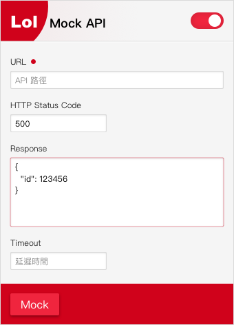

# Lol Mock Api

此為 chrome extension 工具，方便臨時想 Mocking XMLHttpRequest 來製作假資料、測試或模擬 API 情境狀況，使用 [xhr-mock](https://github.com/jameslnewell/xhr-mock) 製作成 chrome extension 方便使用

## 欄位說明

**URL** - 必須與 api 呼叫使用完全一致的網址

**HTTP Status Code** - HTTP Status Code

**Response** - 回應的 `JSON` 文字格式資料

**Timeout** - 模擬 server 回應延遲時間區間毫秒，例如：`200`, `100-200`, `2000-3000`

## Extension Install

未上至 Chrome 線上應用程式商店，所以請下載 <a href="Lol.crx" target="_blank">Lol.crx</a> 後，開啟 `chrome://extensions/` 頁面後將 Lol.crx 拖進頁面中安裝

## Extension

